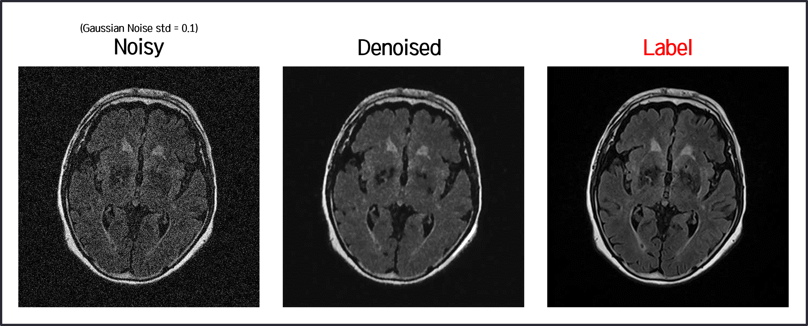

<h1>U-Net Image Denoiser</h1>


### Results




### Installing requirements

```
pip install -r requirements.txt
```

### Training

```
python train.py --epochs=30 --batch=4 --std=0.1 --learning_rate=0.001 --data_dir=./data --checkpoint_dir=./checkpoints
```

### Test

```
python test.py --std=0.1 --data_dir=./data/test --checkpoint=./checkpoints/chk_1_std_0.1.pt
```

### Dataset
FLAIR MRI (private)

### Reference
[Github: Ne2Ne Image Denoiser](https://github.com/neeraj3029/Ne2Ne-Image-Denoising)